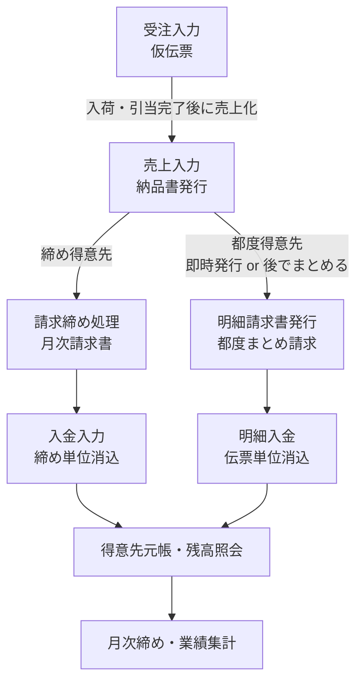

# bmcs_app CLAUDE.md

> このファイルは `石山初期設計/CLAUDE.md.draft` および `石山初期設計/resources/` 配下の画面仕様書一式を統合して作成した。画面ごとの詳細・未解決の不明点は更新頻度が低いため `docs/design_document.md` に、DB設計方針は `docs/database-schema.md` に分離した。実装着手前に必ずそちらを確認・確定させること。
>
> 各画面仕様書に付与されている `SCR-xxx` 等の画面番号は暫定的なものであり、正式な画面IDとして確定していないため、本ファイルでは記載しない。画面は名称で参照する。

---

## Purpose

**販売管理システム**（受注 → 売上 → 請求 → 入金 → 元帳 → 月次締め、の一連の流れを扱う）。石山商店の基幹業務システム。

想定する取引先は大きく2種類あり、業務フローが異なる。

1. **一般企業（締め取引）**: 20日締め・末日締めなど、決まった締め日で1ヶ月分の売上をまとめて請求書発行し、まとめて入金消込する。
2. **官公庁・学校・都度取引先（明細・都度請求）**: 締め処理を行わず、売上（納品）1件〜数件ごとに明細請求書を都度発行し、明細単位で入金消込する。学校のクラス・先生単位など、正式な得意先とは別の「宛名」を都度指定したいというニーズがある。

在庫管理・発注・仕入・買掛・支払は**今回のシステム範囲には含めない**が、将来これらと連携することが分かっているため、連携を見据えた形（カラムを削らない等）で作る。

---

## Tech stack

- C#
- WPF
- 4層構造 + MVVM
- MahApps.Metro
- SQL Server (latest)
- EF Core（O/Rマッパーとして使用。マイグレーション機能は使わず、DBスキーマ変更はAIがSQLCMDでライブDBに直接適用する。詳細は`docs/database-schema.md`参照）
- rowversion（楽観的排他制御）
- Windows 11+
- 非同期処理を適切に使用する（DBアクセス等でUIスレッドをブロックしない）
- Nullable参照型を有効化する（`Nullable enable`）

## Docs map

- [`docs/product-spec.md`](docs/product-spec.md) — 用語、業務フロー、UI/UX 方針
- [`docs/design_document.md`](docs/design_document.md) — 画面ごとの要点一覧、および未解決の不明点・要確認事項（DB以外）
- [`docs/database-schema.md`](docs/database-schema.md) — データベースに関する情報（設計方針・未確定のテーブル/カラム定義等）

## Overview of the Workflow

- 締め得意先は売上入力の時点ではまだ請求書を発行しない。
- 都度得意先は売上入力時に即時請求書を出す場合と、後でまとめて明細請求書発行する場合の両方の想定がある。

補助機能:
- 共通得意先・商品検索モーダル … 全ての伝票入力画面から呼ばれる
- データ横断検索・納品書一括発行画面
- メインメニュー（権限に応じた画面表示制御。認証はメニューUIではなく、起動用ショートカットの実行時パラメータとして社員コードを渡す方式とするため、ログイン画面・ログインUIは不要）
- マスタ管理・プリンタ環境設定

実装着手前に必ず確認すること。
